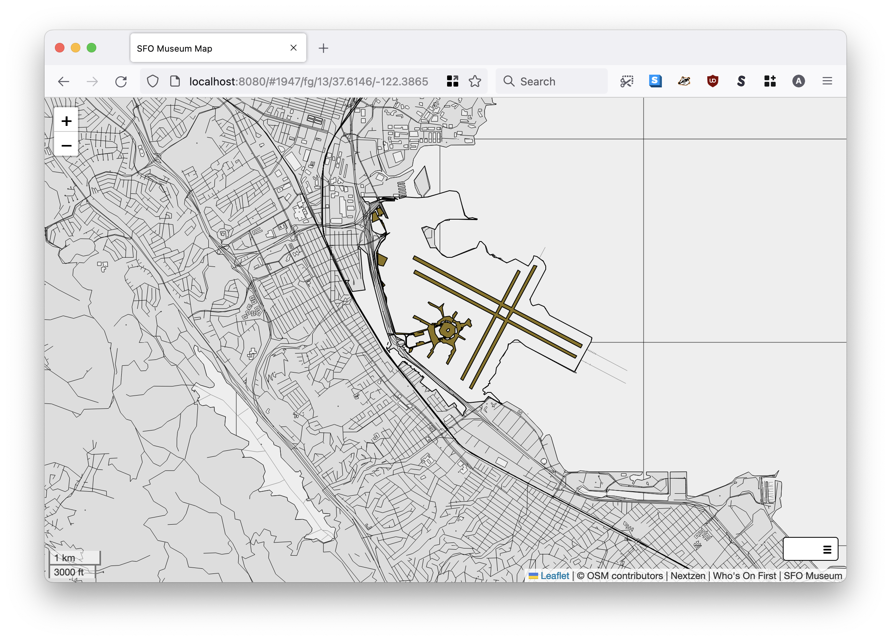
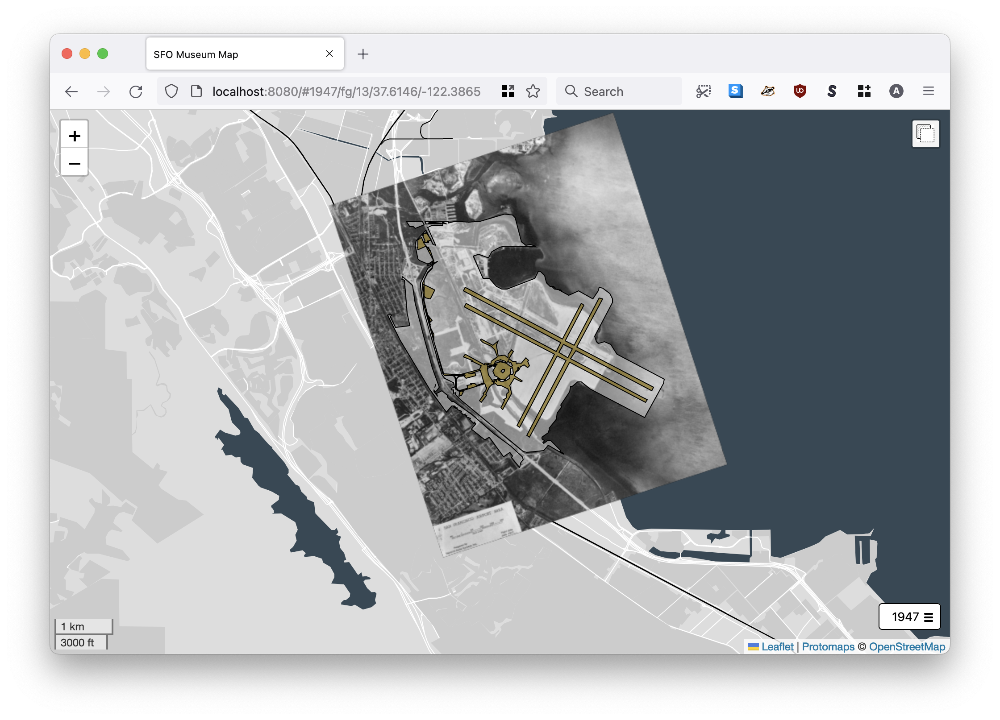
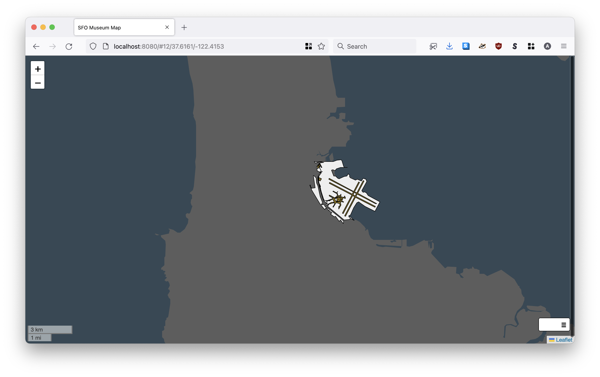
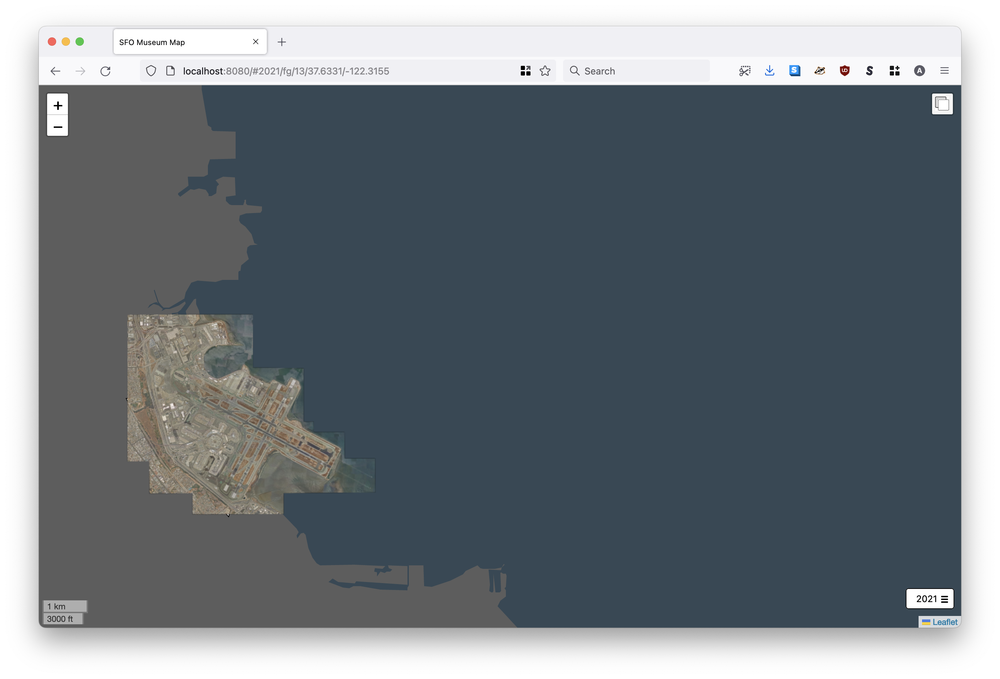

# www-sfomuseum-map

This is a standalone HTML/JavaScript reference application implementing a map element common to all SFO Museum websites.

## Important

* This is not a "drop-in" widget to be used other websites but rather a place where all the necessary code, dependencies and choices surrounding map elements for SFO Museum websites can be reviewed and cloned as necessary.

## Tools

```
$> make cli
go build -mod vendor -o bin/server cmd/server/main.go
```

### server

`server` is a command-line tool (written in Go) to serve the web application in the [www](www) directory. It updates `data-` attributes on the `body` element of HTML pages with map provider and provider-specific details provided by flags.

```
$> ./bin/server -h
  -map-provider string
    	Valid options are: nextzen, protomaps, rasterzen.
  -nextzen-apikey string
    	A valid Nextzen API key.
  -protomaps-apikey string
    	A valid Protomaps API key.
  -server-uri string
    	A valid aaronland/go-http-server URI. (default "http://localhost:8080")
```

For examples, see the "Map providers" section.

#### Notes

The `server` tool is primarily meant for local testing and debugging. If we ever deploy this to production the code should be updated to read `-nextzen-apikey`, `-protomaps-apikey` and other sensitive values using the [sfomuseum/runtimevar](https://github.com/sfomuseum/runtimevar) package.

## Map providers

### Nextzen ("rasterzen")



```
$> go run -mod vendor cmd/server/main.go \
	-map-provider rasterzen \
	-nextzen-apikey {NEXTZEN_APIKEY}
```

### Protomaps



```
$> go run -mod vendor cmd/server/main.go \
	-map-provider protomaps \
	-nextzen-apikey {PROTOMAPS_APIKEY}
```

### Coastline



```
$> go run -mod vendor cmd/server/main.go \
	-map-provider coastline
```

The `coastline` provider is bounded to the San Francisco Bay Area. It provides a basemap consisting only of the coastline of Bay Area derived from a GeoJSON file.

### Coastline (Protomaps)



```
$> go run -mod vendor cmd/server/main.go \
	-map-provider coastline-protomaps
```

The `coastline-protomaps` provider is bounded to the San Francisco Bay Area. It provides a basemap consisting only of the coastline of Bay Area derived from a Protomaps tile database.

## Data

_Documentation for data files is incomplete at this time._

#### Campus

```
$> make campus
```

See also:

* https://spelunker.whosonfirst.org/id/102527513/
* https://github.com/sfomuseum-data/sfomuseum-data-whosonfirst/blob/main/data/102/527/513/102527513.geojson

#### Complex

```
$> make complex
```

See also:

* https://github.com/sfomuseum-data/sfomuseum-data-architecture    

### `sfomuseum.maps.data.js`

```
$> make data-js
```

### `sfomuseum.maps.catalog.js`

_TBW_

See also:

* https://github.com/sfomuseum/go-sfomuseum-maps

## See also

### Tiles

* https://leafletjs.com/
* https://protomaps.com/
* https://github.com/whosonfirst/go-rasterzen

### Leaflet

* https://github.com/jjimenezshaw/Leaflet.Control.Resizer
* https://github.com/sfomuseum/leaflet-layers-control
* https://github.com/sfomuseum/leaflet-toggle-control

### Tools

* https://github.com/sfomuseum/go-sfomuseum-maps
* https://github.com/sfomuseum/go-sfomuseum-geometry

### Data

* https://github.com/sfomuseum-data/sfomuseum-data-architecture
* https://github.com/sfomuseum-data/sfomuseum-data-whosonfirst

### Theory

* https://millsfield.sfomuseum.org/blog/tags/maps